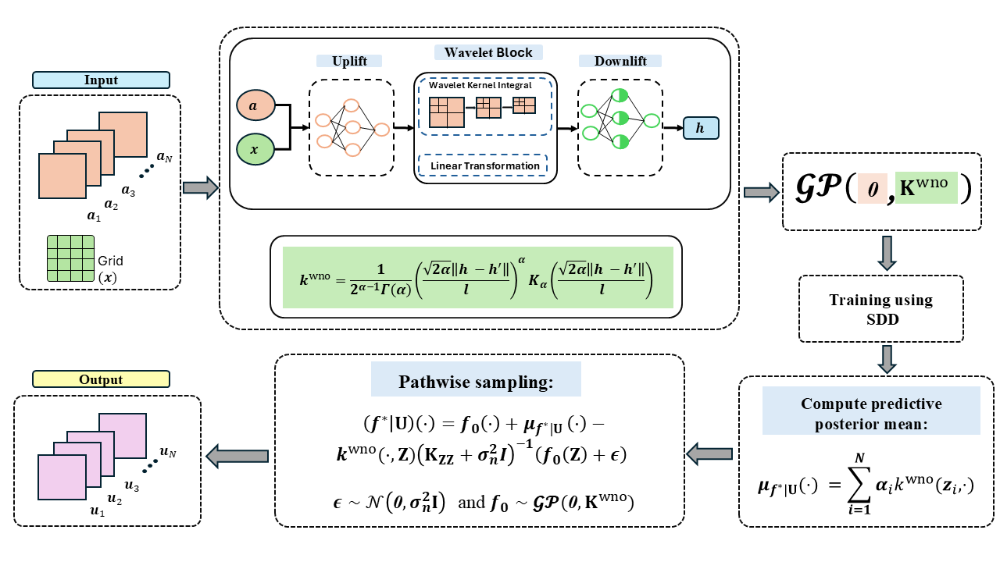

# Gaussian Process Operator (GPO)

## Description
This repository contains the implementation code for the paper "Towards Gaussian Process for operator learning: An uncertainty aware resolution independent operator learning algorithm for computational mechanics" [here](<Link-to-your-paper>). 



## Folders & Files
The repository is organized as follows:
+ `data`: Contains the datasets.
+ `experiments`: Each sub-directory contains the specific code for various case studies
+ `general`: Utils and additional resources.
+ `requirement.txt`: additional packages required.

## Getting Started

### Prerequisites
Before running the code, ensure you have the following installed:
- Python 3.8+
- PyTorch 1.7+
- Additional dependencies listed in `requirements.txt`

### Installation
Clone the repository and install the required Python packages:
```bash
git clone https://github.com/yourusername/your-repository-name.git
cd your-repository-name
pip install -r requirements.txt
```

### Dataset
  + The training and testing datasets for different case studies are available in the following link:
    > [Dataset](https://drive.google.com/drive/folders/1kKjXjvqdMiDnqRN0rUVr2ENf9583-zTS?usp=sharing) \


## BibTex
If you use any part our codes, please cite us at,
```
@misc{kumar2024gaussianprocessoperatorlearning,
      title={Towards Gaussian Process for operator learning: an uncertainty aware resolution independent operator learning algorithm for computational mechanics}, 
      author={Sawan Kumar and Rajdip Nayek and Souvik Chakraborty},
      year={2024},
      eprint={2409.10972},
      archivePrefix={arXiv},
      primaryClass={stat.ML},
      url={https://arxiv.org/abs/2409.10972}, 
}
```

